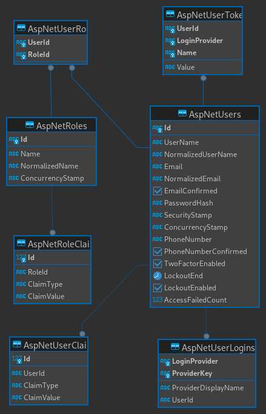
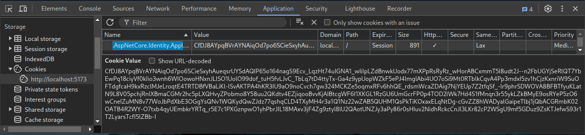

# Tutorial Authentication

The goal of this Tutorial is to teach you how to implement password based
authentication with ASP.NET Core and React.

We will use ASP.NET Core Identity with some customizations.

In short: ASP.NET Core Identity is opinionated, yet customizable plumbing for
adding account functionality (including login and registration) to ASP.NET Core
applications.

You can read about [ASP.NET Core
Identity](https://learn.microsoft.com/en-us/aspnet/core/security/authentication/identity?view=aspnetcore-8.0&tabs=net-cli)
using the link.
However don't follow their tutorial. Follow this instead ;)

Moving forward I will refer to it as Identity.

When working through this tutorial, I suggest you type the code/commands
yourself, unless stated otherwise.

# Database

Identity uses some database tables for storage as shown in the diagram.



Here is a quick description of the tables.

| Entity type | Description                                                   |
| ----------- | ------------------------------------------------------------- |
| User        | Represents the user.                                          |
| Role        | Represents a role.                                            |
| UserClaim   | Represents a claim that a user possesses.                     |
| UserToken   | Represents an authentication token for a user.                |
| UserLogin   | Associates a user with a login.                               |
| RoleClaim   | Represents a claim that's granted to all users within a role. |
| UserRole    | A join entity that associates users and roles.                |

_[Source](https://learn.microsoft.com/en-us/aspnet/core/security/authentication/customize-identity-model?view=aspnetcore-8.0#the-identity-model)_

> When an identity is created it may be assigned one or more claims issued by a trusted party. A claim is a name value pair that represents what the subject is, not what the subject can do. For example, you may have a driver's license, issued by a local driving license authority. Your driver's license has your date of birth on it. In this case the claim name would be `DateOfBirth`, the claim value would be your date of birth, for example `8th June 1970` and the issuer would be the driving license authority.

[Source](https://learn.microsoft.com/en-us/aspnet/core/security/authorization/claims)

We don't need to write code ourselves to access data in those tables.
Just add a package for it!
Run the following command from a terminal within your repository to add the package.

```sh
dotnet add server/DataAccess package Microsoft.AspNetCore.Identity.EntityFrameworkCore --version 8.0.7
```

The `User` table with Identity got many more fields than what our current `User` table got.

We can change our `User` class to also have those fields by making it a
subclass of `IdentityUser`.

Change `server/DataAccess/Entities/User.cs` to:

```cs
using Microsoft.AspNetCore.Identity;

namespace DataAccess.Entities;

public class User : IdentityUser { }
```

The `IdentityUser` base class got all the previous fields from `User` defined and then some (see schema diagram above).

C# classes are mapped to database tables through an instance of DbContext.
The package you added before contains an extended version of DbContext called
IdentityDbContext that automatically maps all the additional tables required
to use Identity.
To use it, you need to change the base class in
`server/DataAccess/AppDbContext.cs` from `DbContext` to
`IdentityDbContext<User>`.
With the file open, you also need to remove the `DbSet<User> Users` property,
since it is already defined by `IdentityDbContext`.

Next, we need to configure our program to take advantage of Identity features
and tell it how to talk to the database.

In [Program.cs](server/Api/Program.cs), inside `#region Security` line, add:

```cs
builder
    .Services.AddIdentityApiEndpoints<User>()
    .AddRoles<IdentityRole>()
    .AddEntityFrameworkStores<AppDbContext>();
```

When you run the server it uses [DbSeeder.cs](server/Service/DbSeeder.cs) to
provide some test data.

Replace the [DbSeeder.cs](server/Service/DbSeeder.cs) file with the content of
[this
link](https://gist.githubusercontent.com/rpede/04b53f81c75abe755b44f53085dc3160/raw/02a8d0a815326054d802f1a5783d04dac4e13051/DbSeeder.cs).
You can just copy-paste it.
No point in writing it out by hand.

This is just to make the tutorial work.
In your application, you will create your tables from SQL file instead.

You then need to reset the database, so the Identity tables can be added.
This can be done by discarding the current postgres container and starting a new.

Make sure the server application isn't running, then execute:

```sh
docker compose down --remove-orphans && docker compose up -d
```

Start the server again with `dotnet watch --project server/Api` which will create the new schema.

Take a look at the tables in DataGrip or Rider.
In Database panel click "+" button.
Then "Data source from URL" and paste
`jdbc:postgresql://localhost:5432/postgres?password=mysecret&user=postgres`

## Endpoints

Now that Identity is wired up.
We can start implementing endpoints for login and registration.

You can find a skeleton for the endpoints in
`server/Api/Controllers/AuthController.cs`.

Implement these rules:

### Login

1. Validate `LoginRequest` and throw exception if validation fails.
2. Attempt to authenticate using `signInManager.PasswordSignInAsync`
   - Throw `AuthenticationError` if the return value indicates an error.
3. Return `LoginResponse` on success

### Register

1. Validate `RegisterRequest` and throw exception if validation fails.
2. Attempt to create a new user using `userManager.CreateAsync`.
   - Create new `User` object with email and name from `RegisterRequest`.
   - A password from `RegisterRequest` as second parameter.
   - Throw `ValidationError` if the return value indicates an error.
3. Use `userManager.AddToRoleAsync` to add a role of `"Reader"` to the newly
   created user.
   - You can find constants for the roles in [Role.cs](server/Service/Role.cs)
4. Return `RegisterResponse` with email and username from the user object.

Hint: Convert `IdentityResult` to `ValidationError` with:

```cs
new ValidationError(
    result.Errors.ToDictionary(x => x.Code, x => new[] { x.Description })
)
```

Where `result` is the return value from `userManager.CreateAsync`.

### User Info

Replace the body of `UserInfo` endpoint with:

```cs
var username = (HttpContext.User.Identity?.Name) ?? throw new AuthenticationError();
var user = await userManager.FindByNameAsync(username) ?? throw new AuthenticationError();
var roles = await userManager.GetRolesAsync(user);
var isAdmin = roles.Contains(Role.Admin);
var canPublish = roles.Contains(Role.Editor) || isAdmin;
return new AuthUserInfo(username, isAdmin, canPublish);
```

When using Identity, after a user has been authenticated, information about
them can be accessed from `HttpContext.User`.
So, the `UserInfo` endpoint simply returns some information about the authenticated user.
The client can use this information to determine what to show.

### Logout

Replace body of `Logout` method with:

```cs
await signInManager.SignOutAsync();
return Results.Ok();
```

Remember to remove the `throw new NotImplementedException()` lines.

<small>[Check your progress](https://gist.github.com/rpede/04b53f81c75abe755b44f53085dc3160#file-authcontroller-cs)</small>

When you are done implementing the endpoints you can try it out with swagger
from
[http://localhost:5088/api/swagger/index.html](http://localhost:5088/api/swagger/index.html)

You can see credentials for the test users in [README](../README.md).

## Client login

To use the new endpoints in the application there are some changes that need to
be made to the client.

Open `client/src/atoms/auth.ts`.

Replace the `useAuth` function with:

```ts
const isLoggedInAtom = atom(false);

const userInfoAtom = atom(async (get) => {
  if (get(isLoggedInAtom)) {
    const response = await http.authUserinfoList();
    return response.data;
  } else {
    return null;
  }
});

export const useAuth = () => {
  const [_, setIsLoggedIn] = useAtom(isLoggedInAtom);
  const [user] = useAtom(userInfoAtom);
  const navigate = useNavigate();

  const login = async (credentials: Credentials) => {
    await http.authLoginCreate(credentials);
    setIsLoggedIn(true);
    navigate("/");
  };

  const logout = async () => {
    await http.authLogoutCreate();
    navigate("/login");
  };

  return {
    user,
    login,
    logout,
  } as AuthHook;
};
```

How it works:

- `useAuth` hook is invoked at the top of any component that deals with
  authentication or need to know who is logged in.
- The hook returns information about the user (if any). Also, a function for
  login and logout.
- When invoking the login function it sends credentials to server.
- On successful response from server, we set the `setIsLoggedIn` atom to true.
- It will cause `userInfoAtom` to fetch user information from server, which can
  be used in any component.

<small>[Check your progress](https://gist.github.com/rpede/04b53f81c75abe755b44f53085dc3160#file-auth-ts)</small>

Now, change the login form in `client/src/pages/auth/login.tsx` to use the
hook.

Add an import for `useAuth` and invoke the hook at the top of the Login
component:

```tsx
const { login } = useAuth();
```

Replace the body of `onSubmit` function to:

```tsx
toast.promise(login(data), {
  success: "Logged in successfully",
  error: "Invalid credentials",
  loading: "Logging in...",
});
```

Because `login` function returns a promise we can use `toast.promise` to show
and update a toast.

<small>[Check your progress](https://gist.github.com/rpede/04b53f81c75abe755b44f53085dc3160#file-login-tsx)</small>

You can actually try it out now.
Make sure you've started both client and server, then login with one of the
existing users.

<http://localhost:5173/login>

Find credentials for the test users in [README](../README.md).

## Behind the scenes

When you sign-in, Identity will automatically issue a session cookie.
You can see the cookie using developer tools in your browser (CTRL+SHIFT+i).



Documentation on what the cookie contains is a bit sparse, but it seems to be
encrypted information about the user.
The information includes user ID and roles.

## Password hashing

By default, Identity use the following hashing algorithm for password storage:

> PBKDF2 with HMAC-SHA512, 128-bit salt, 256-bit subkey, 100000 iterations.

<small>[Source](https://github.com/dotnet/aspnetcore/blob/main/src/Identity/Extensions.Core/src/PasswordHasher.cs)</small>

This algorithm is probably fine for most cases.
However, since you are supposed to learn about password storage.
Let's change it to a state-of-the-art algorithm.

.NET unfortunately doesn't have an implementation of Argon2id built-in.
So, we will have to grab a package for it.

The most popular option on NuGet is
[Konscious.Security.Cryptography.Argon2](https://www.nuget.org/packages/Konscious.Security.Cryptography.Argon2).

Add it to your project with:

```sh
dotnet add server/Service package Konscious.Security.Cryptography.Argon2 --version 1.3.1
```

To use the algorithm we first need to make a new implementation of
IPasswordHasher interface.
SignInManager uses an implementation of IPasswordHasher to (drum roll) hash
passwords.
So, we just swap out the default implementation with one that uses argon2id.

Add a new file `server/Service/Security/Argon2idPasswordHasher.cs` with the
following.

```cs
using System.Runtime.CompilerServices;
using System.Security.Cryptography;
using System.Text;
using Konscious.Security.Cryptography;
using Microsoft.AspNetCore.Identity;

namespace Service.Security;

public class Argon2idPasswordHasher<TUser> : IPasswordHasher<TUser> where TUser : class
{
    const string Name = "argon2id";
    public string HashPassword(TUser user, string password)
    {
        var salt = RandomNumberGenerator.GetBytes(128 / 8);
        var hash = GenerateHash(password, salt);
        return $"{Name}${Encode(salt)}${Encode(hash)}";
    }

    public PasswordVerificationResult VerifyHashedPassword(TUser user, string hashedPassword, string providedPassword)
    {
        var parts = hashedPassword.Split('$');
        var salt = Decode(parts[1]);
        var storedHash = Decode(parts[2]);
        var providedHash = GenerateHash(providedPassword, salt);
        return ByteArraysEqual(storedHash, providedHash)
            ? PasswordVerificationResult.Success : PasswordVerificationResult.Failed;
    }

    public byte[] GenerateHash(string password, byte[] salt)
    {
        using var hashAlgo = new Argon2id(Encoding.UTF8.GetBytes(password))
        {
            Salt = salt,
            MemorySize = 12288,
            Iterations = 3,
            DegreeOfParallelism = 1,
        };
        return hashAlgo.GetBytes(256 / 8);
    }

    protected byte[] Decode(string value)
    {
        return Convert.FromBase64String(value);
    }

    protected string Encode(byte[] value)
    {
        return Convert.ToBase64String(value);
    }

    // Compares two byte arrays for equality. The method is specifically written so that the loop is not optimized.
    // From: https://github.com/aspnet/AspNetIdentity/blob/main/src/Microsoft.AspNet.Identity.Core/Crypto.cs
    [MethodImpl(MethodImplOptions.NoOptimization)]
    private static bool ByteArraysEqual(byte[] a, byte[] b)
    {
        if (a.Length != b.Length)
        {
            return false;
        }
        var areSame = true;
        for (var i = 0; i < a.Length; i++)
        {
            areSame &= a[i] == b[i];
        }
        return areSame;
    }
}
```

Take a moment to read the code before you move along.

The `ByteArraysEqual` will always take the same amount of time to execute, no
matter how similar or far apart the two hashes are.
It is to prevent [timing attacks](https://en.wikipedia.org/wiki/Timing_attack).

As you know, we both need to store the hash and salt.
The salt needs to be stored, so we can recreate the hash next time user enters
their password.

In the `HashPassword` method we are combining algorithm name, salt and hash to
a single string for database storage.

The algorithm name is useful in case we ever need to upgrade the algorithm.

Hypothetically, to upgrade the hash algorithm one would:

1. Calculate hash using the old algorithm.
2. Compare against what is stored in database.
3. If the hashes match:
   1. Calculate a hash using the new algorithm.
   2. Update the hash stored in database to the new.

To use Argon2idPasswordHasher you just configure it like any other service in
`Program.cs`.
Add this inside `#region Security`:

```cs
builder.Services.AddSingleton<IPasswordHasher<User>, Argon2idPasswordHasher<User>>();
```

SignInManager will now use our new implementation instead of the default
algorithm.

You need to re-create the database since the password hash format is different.
The easiest way is just to throw away the database container and create a new.

```sh
docker compose down --remove-orphans && docker compose up -d
```

You also need to restart the server.

Try it out!

Go to <http://localhost:5173/login> and enter some credentials.

After, take a look at the hash in AspNetUser table.
You can use either Rider or DataGrip.

Here is the hash I got:

```
argon2id$//1IKnEe6mbabR5IkY63AA==$l6tqeMD5ysZAH4ICQlS8Zz30DaZWay0mBGAJZHHaLZA=
```

Notice the `argon2id` prefix.
Yours will be different btw.

## Outro

Well done.
Commit your changes!

### Auth endpoints

Just about every web application needs endpoints similar to the auth endpoints
you wrote in this tutorial.
Users need to be able to register, login etc.

There is actually already an implementation of these endpoints in Identity.
You can try it out by out-commenting all the code in `AuthController.cs`.
Then add the line `app.MapIdentityApi<User>();` just above
`app.MapControllers();` in `Program.cs`.

If you try it out, make sure you undo it again as the next tutorial assumes the
handwritten endpoints as shown in this.

### Password algorithm

Is it worth to change the password hashing algorithm?
Probably not.
I just wanted to show you how it can be done.

Many people (for some reason) are still using something terrible such as simple
SHA256 without salt.
I just want to make sure that you know better!

[Reference solution](https://github.com/rpede/cds24-tutorial-auth/tree/00-authentication)